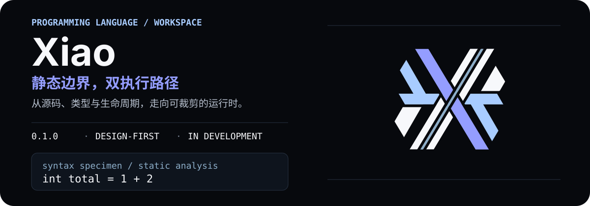
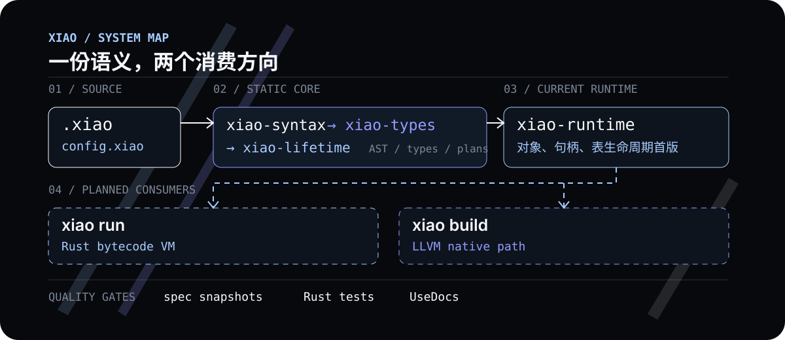

<div align="center">
  
</div>

<p align="center">
  <a href="./docs/UseDocs/README.md">使用文档</a>
  ·
  <a href="./docs/DevDocs/README.md">开发文档</a>
  ·
  <a href="./tests/spec/README.md">规格快照</a>
  ·
  <a href="./LICENSE">MIT License</a>
</p>

# Xiao

Xiao 是一个正在构建中的编程语言与工具链工程：用 Rust 建立语言核心、静态分析和 Runtime，用 TypeScript 负责 CLI / REPL 的终端边界。它的长期目标是让同一份语义同时服务于快速反馈的字节码路径和可裁剪的 LLVM 原生路径。

> **当前状态**：仓库仍处于设计与实现阶段，不是可安装发行版。词法、语法、类型、模块、生命周期和 Runtime 的一部分已经可以通过 Rust 测试与规格快照验证；`xiao run`、`xiao build` 和完整 CLI 仍是后续阶段的目标入口。

## 先看它现在能做什么

- **语言前端**：已完成 F0/L0/L1/L2 词法、P0/P1 解析入口、表达式与选择器，以及声明、容器、集合和表的 AST 结构。实现位于 [`xiao-syntax`](./core/rust/crates/xiao-syntax/README.md)。
- **静态语义**：已建立标量类型、显式转换、容器约束、集合运算、模块依赖图和 `config.xiao` 声明式检查。实现位于 [`xiao-types`](./core/rust/crates/xiao-types/README.md) 及相关 Rust crate。
- **生命周期与 Runtime 首版**：`xiao-lifetime` 能生成确定性释放计划；`xiao-runtime` 已覆盖不透明对象头、Strong/Weak 句柄、`str`、固定宽度标量和表生命周期首版，但还没有完整容器 Runtime、VM 或并发能力。
- **工程门禁**：规格快照、Rust 单元测试、目录检查、2500 物理行门禁、文档覆盖率和 UseDocs 同步规则一起维护，避免把“已解析”误写成“已执行”。

这些能力目前主要面向工程验证和语言设计迭代；它们不等同于已经发布的 Xiao 编译器或可执行程序。

## 语义如何汇入两条路径

<p align="center">
  
</p>

图中的实线表示当前已经建立的核心边界，虚线表示规划中的消费者。两条执行路径必须共享同一套类型化语义、诊断和生命周期约束，而不是在 CLI 或后端各自复制一份语言规则。

## 语言形状

下面的片段来自当前已验证的函数语法。它展示的是解析与静态检查的输入形状；当前版本尚不执行 Xiao 源码。

```xiao
def greet(str name = "world") -> str
    return name
```

更多已经冻结的语法与边界：

- [词法与源码位置](./docs/UseDocs/language/lexical/README.md)
- [静态标量类型](./docs/UseDocs/language/basics/types/README.md)
- [容器与集合](./docs/UseDocs/language/collections/README.md)
- [函数与控制流](./docs/UseDocs/language/functions/README.md)
- [Runtime 对象与表生命周期](./docs/UseDocs/language/memory/runtime/README.md)

## 开发验证

当前仓库从根目录执行以下检查。它们验证工程、文档和 Rust 核心，不会假装提供尚未完成的 `xiao` 安装命令。

```bash
# JavaScript / TypeScript workspace
bun install
bun run check
bun test

# Rust language core
cargo test --manifest-path core/rust/Cargo.toml
```

`bun run check:layout` 与 `bun run check` 在发现超长 Rust 文件时会请求 Rust AST 大纲，因此需要
Rust 工具链；可先运行 `cargo build --manifest-path core/rust/Cargo.toml -p xiao-doc-coverage-rust`，
或设置 `XIAO_RUST_DOC_ADAPTER` 指向预编译二进制。当前这两个检查按设计为红：
`core/rust/crates/xiao-bytecode/src/research/encode.rs`（3847 行）和
`core/rust/crates/xiao-syntax/src/parser.rs`（3040 行）已被 `A0-SIZE-001` 列为后续拆分债务，
不得用豁免掩盖。其余检查仍应正常通过。

环境基线见 [`package.json`](./package.json)（Bun `1.4.x`）和 [`core/rust/Cargo.toml`](./core/rust/Cargo.toml)（Rust `1.85+`）。

## 阅读路线

| 你想了解什么 | 从这里开始 |
| --- | --- |
| 学习 Xiao 当前已验证的语言形状 | [`docs/UseDocs/README.md`](./docs/UseDocs/README.md) |
| 了解阶段顺序、决策和交接边界 | [`docs/DevDocs/README.md`](./docs/DevDocs/README.md) |
| 查看实现与测试规格 | [`tests/spec/README.md`](./tests/spec/README.md) |
| 了解 Rust 核心目录 | [`core/rust/README.md`](./core/rust/README.md) |
| 了解 CLI / REPL 的边界 | [`cli/README.md`](./cli/README.md) |
| 查看 Logo 与品牌资源 | [`resources/brand/README.md`](./resources/brand/README.md) |

## 当前里程碑

**已建立的闭环**

- `01`：词法、解析器入口、表达式与选择器的静态闭环。
- `02–05`：类型、容器/集合、函数控制流、模块、表和 `config.xiao` 的静态闭环。
- `06-A`：作用域、逃逸事实、所有权图和确定性释放计划。
- `06-B`：Runtime 对象、Strong/Weak 句柄、表状态机和清理错误展开首版。

**接下来的消费阶段**

- `07–08`：统一错误模型、前端管线和类型化 IR。
- `09–11`：Rust 字节码 VM、LLVM 原生后端、CLI、REPL 与平台接线。
- `13–19`：优化、`.xiaoc` / `.xar` 产物、缓存、兼容性和发布验收。

阶段状态与退出条件以[开发文档主表](./docs/DevDocs/README.md)为准；主页只保留面向新读者的导航，不复制整份语言规格。

## 目录骨架

```text
core/rust/       Rust 语言核心、类型系统、生命周期与 Runtime
cli/ts/          TypeScript CLI / REPL 边界
docs/DevDocs/    设计决策、阶段交接与工程约束
docs/UseDocs/    面向使用者的学习、配置和排错路径
tests/spec/      规格输入、正反例与快照
resources/brand/ Logo 与静态品牌资源
```

## 许可证

[MIT](./LICENSE)
