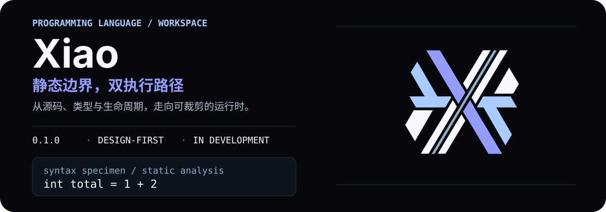
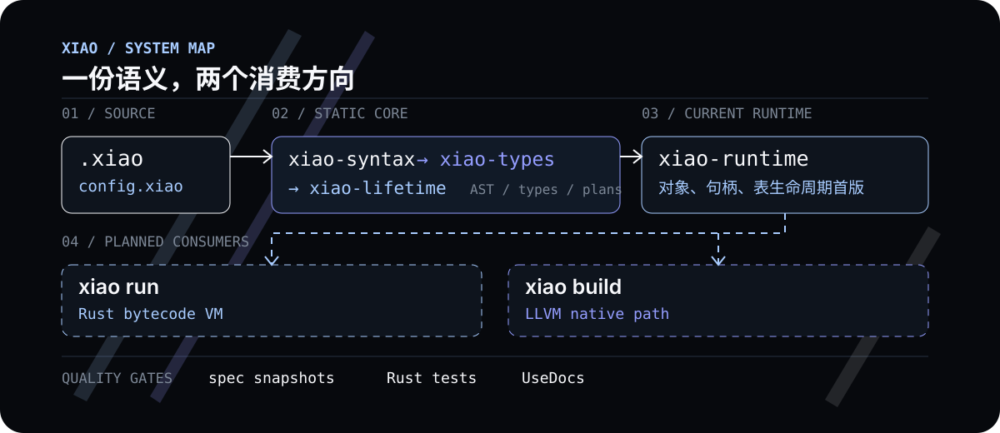

<div align="center">
  
</div>

<p align="center">
  <a href="https://github.com/Programming-Language-Xiao/Xiao/actions/workflows/platform-reproduction.yml"></a>
  
  
  
  
</p>

<p align="center">
  <a href="./docs/UseDocs/README.md">使用文档</a>
  ·
  <a href="./docs/DevDocs/README.md">开发文档</a>
  ·
  <a href="./tests/spec/README.md">规格快照</a>
  ·
  <a href="./LICENSE">MIT License</a>
</p>

# Xiao

Xiao 是一个正在构建中的编程语言与工具链工程：用 Rust 建立语言核心、静态分析和 Runtime，用 TypeScript 负责 CLI / REPL 的终端边界。它的长期目标是让同一份语义同时服务于快速反馈的字节码路径和可裁剪的 LLVM 原生路径。

> **当前状态**：仓库仍处于设计与实现阶段，不是可安装发行版。**语言前端、静态语义、生命周期、字节码 VM、LLVM 原生后端、包管理、交互式终端、优化管线与 `.xiaoc` 产物均已交付**；**SHA-256 内容寻址与二进制索引正在实施**。

## 先看它现在能做什么

- **语言前端**：已完成 F0/L0/L1/L2 词法、P0/P1 解析入口、表达式与选择器，以及声明、容器、集合和表的 AST 结构。实现位于 [`xiao-syntax`](./core/rust/crates/xiao-syntax/README.md)。
- **静态语义**：已建立标量类型、显式转换、容器约束、集合运算、模块依赖图和 `config.xiao` 声明式检查。实现位于 [`xiao-types`](./core/rust/crates/xiao-types/README.md) 及相关 Rust crate。
- **生命周期与 Runtime**：`xiao-lifetime` 生成确定性释放计划；`xiao-runtime` 覆盖不透明对象头、Strong/Weak 句柄、`str`、固定宽度标量、表生命周期，以及**容器、选择器、集合与迭代的 Runtime 能力**。
- **字节码执行**：`xiao-vm` 已是可运行的寄存器机型解释器（三种候选机型与冻结的指令编码），支持容器、选择器、集合、`for` 迭代、表声明和 `try`/`catch`/`finally` 的统一异常路由。
- **LLVM 原生后端**：`xiao-codegen-llvm` 能把同一份类型化 IR 降低为原生程序，含 Runtime ABI、错误路径与源码映射、平台异常报告、`-debug` 独立诊断窗口，以及**可解释的 Runtime 裁剪报告**。
- **优化管线**：`xiao-optimizer` 提供规范化优化配置与稳定指纹、共享 Pass 接口与假设、快照回滚与验证阻断；字节码与 LLVM 两条路径**消费同一套 `-O0`–`-O3` 配置**，未实现的级别明确报告跳过。
- **`.xiaoc` 产物**：单模块确定性分段二进制，含严格边界与完整性校验；加载器**先验证再建 VM**，损坏或非规范的产物不执行任何指令。
- **工程门禁**：规格快照、Rust 单元测试、目录检查、2500 物理行门禁、文档覆盖率和 UseDocs 同步规则一起维护，避免把“已解析”误写成“已执行”。

这些能力目前主要面向工程验证和语言设计迭代；它们不等同于已经发布的 Xiao 编译器或可执行程序。四平台（Windows、Linux amd64/arm64、macOS arm64）的原生功能证据通过周期性 CI 采集。

## 语义如何汇入两条路径

<p align="center">
  
</p>

图中的两条执行路径都已接通：同一份类型化 IR 既降低为字节码交给 `xiao-vm`，也降低为 LLVM IR 交给原生后端。两条路径共享同一套类型化语义、诊断和生命周期约束，而不是在 CLI 或后端各自复制一份语言规则；优化配置与指纹同样只此一份。

## 语言形状

下面的片段来自当前已验证的函数语法，它既能被 `xiao run` 直接执行，也能由 `xiao build` 编译为原生程序。

```xiao
def greet(str name = "world") -> str
    return name
```

更多已经冻结的语法与边界：

- [词法与源码位置](./docs/UseDocs/language/lexical/README.md)
- [静态标量类型](./docs/UseDocs/language/basics/types/README.md)
- [容器与集合](./docs/UseDocs/language/collections/README.md)
- [函数与控制流](./docs/UseDocs/language/functions/README.md)
- [Runtime 对象与表生命周期](./docs/UseDocs/language/memory/runtime/README.md)

## 开发验证

当前仓库从根目录执行以下检查。它们验证工程、文档和 Rust 核心，不会假装提供尚未完成的 `xiao` 安装命令。

```bash
# JavaScript / TypeScript workspace
bun install
bun run check
bun test

# Rust language core
cargo test --manifest-path core/rust/Cargo.toml
```

`bun run check:layout` 与 `bun run check` 在发现超长 Rust 文件时会请求 Rust AST 大纲，因此需要
Rust 工具链；可先运行 `cargo build --manifest-path core/rust/Cargo.toml -p xiao-doc-coverage-rust`。
**推荐再设置 `XIAO_RUST_DOC_ADAPTER` 指向该二进制**：适配器默认通过 `cargo run` 启动，而
cargo 的进程创建本身就要约 10 秒（实测本机 `cargo --version` 即需 10.2 秒），直调已构建的
二进制只要约 64 毫秒。`xiao-bytecode` 的研究编码器和
`xiao-syntax/src/parser.rs` 均已拆为门面与职责子模块，当前尺寸门禁应全绿，
不得用豁免掩盖未来可拆分的超长文件。其余检查仍应正常通过。

在 Linux 上开发时可以用仓库根的 [`Dockerfile.dev`](./Dockerfile.dev)：它钉死与仓库一致的
Rust `1.96.0` 与 Bun `1.4.0`，用法见文件头部注释。容器只用于开发与验证，
**不是验收路径的一部分**——09R3 的基准数字只在 Windows 原生采。

环境基线见 [`package.json`](./package.json)（Bun `1.4.x`）和 [`core/rust/Cargo.toml`](./core/rust/Cargo.toml)（Rust `1.85+`）。

部分原生与产物测试需要外部工具链（LLVM 工具、链接器、strip 等），它们以 `#[ignore]`
标记并由环境变量门控——**缺少变量时直接失败，而不是静默跳过**，以免把“没跑”当成“通过”。
准备方式见 [10D 环境依赖测试专项规范](./docs/DevDocs/10d-environment-gated-test-spec.md)；
四平台 CI 会执行全部门控测试，因此这些测试并非只在本地可用。

## 阅读路线

| 你想了解什么 | 从这里开始 |
| --- | --- |
| 学习 Xiao 当前已验证的语言形状 | [`docs/UseDocs/README.md`](./docs/UseDocs/README.md) |
| 了解阶段顺序、决策和交接边界 | [`docs/DevDocs/README.md`](./docs/DevDocs/README.md) |
| 查看实现与测试规格 | [`tests/spec/README.md`](./tests/spec/README.md) |
| 了解 Rust 核心目录 | [`core/rust/README.md`](./core/rust/README.md) |
| 了解 CLI / REPL 的边界 | [`cli/README.md`](./cli/README.md) |
| 查看 Logo 与品牌资源 | [`resources/brand/README.md`](./resources/brand/README.md) |

## 当前里程碑

**已建立的闭环**

- `01–08`：词法、解析、类型、容器/集合、函数控制流、模块、表与 `config.xiao` 的静态闭环；作用域、逃逸事实、所有权图和确定性释放计划；统一错误模型、前端管线和类型化 IR。
- `09`：字节码运行模式——三种候选机型、冻结的指令编码，以及容器、选择器、集合、迭代和表声明的执行路径。
- `10`：LLVM 原生后端 **N0-A/B/C/D 全部交付**——Runtime ABI、错误路径与源码映射、`-debug` 独立诊断窗口，以及产物层的 Runtime 裁剪验证。
- `11A`：虚拟环境与包管理**已完成**，含配置/环境指纹、内容寻址缓存、锁文件与首个远程闭环。
- `11B`：交互式终端 `I0–I4b` 已按各自范围交付（会话生命周期仍有收尾项）。
- `11C`：国际化 `L0–L3` 已交付（跨平台与语言包收尾项在途）。
- `13`–`15`：优化契约与统一管线、差分夹具、`.xiaoc` 格式与字节码 Pass、LLVM Pass 映射与 Runtime 裁剪、可复现构建、产物层验收与 CI 门控（含真实产物门控，四平台实测全绿）。
- `16`：SHA-256 内容寻址与二进制索引——对象与索引、边界修复、缓存维护；跨进程锁已收成 `xiao-lock` 一套。

**正在进行**

- `20AB`：intrinsic 契约与最小生产入口——把「按名称认函数」换成按表分派，`print`/`input` 是第一批。
- `11`：macOS 真实终端环境的平台证据补全（受环境限制，非工程欠账）。

**后续**

- `17`：`.xar` 字节码归档与启动——端到端验收依赖 `20AB` 的 `print` 才能观察运行结果。
- `18`：优化与产物 CLI 接入。
- `19`：兼容性、版本矩阵与发布验收。

阶段状态与退出条件以[开发文档主表](./docs/DevDocs/README.md)为准；主页只保留面向新读者的导航，不复制整份语言规格。

## 目录骨架

```text
core/rust/       Rust 语言核心、类型系统、生命周期与 Runtime
cli/ts/          TypeScript CLI / REPL 边界
docs/DevDocs/    设计决策、阶段交接与工程约束
docs/UseDocs/    面向使用者的学习、配置和排错路径
tests/spec/      规格输入、正反例与快照
resources/brand/ Logo 与静态品牌资源
```

## 仓库活跃度

<p align="center">
  
</p>

## 许可证

[MIT](./LICENSE)
