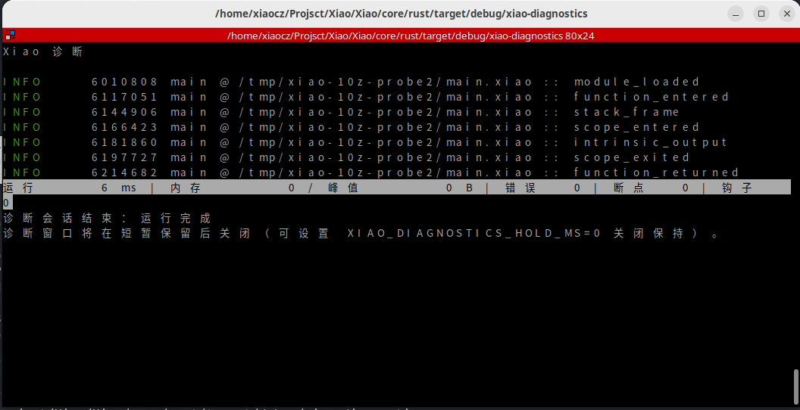
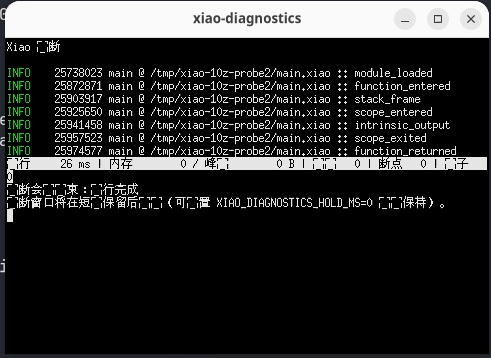

# 10Z Linux 裸机窗口原始输出（2026-10-10）

对应 [10Z Linux 裸机窗口取证结果](10z-linux-bare-metal-results-20261010.md)。
窗口截图见结果文档中的两个图片链接。

## 命令输出

```text
window-probe
状态  退出码
----  ------
成功  0
缓存 hit  xiaoc  摘要 c50aef82928645cad4d9239403243b7d53864220ed992de2ea5383d7b7c99920  校验 verified
优化 O0：已执行 0/5 个 Pass
```

## 窗口观察

真实桌面会话中观察到两个相关窗口：外部终端与独立 `xiao-diagnostics` 窗口。其中一个
终端的 CJK 字符出现乱码或缺字，另一个终端能显示完整事件结构；这属于终端字体/locale
渲染差异，窗口启动和诊断事件取证仍成立。
诊断窗口显示了以下事件：

```text
module_loaded
function_entered
stack_frame
scope_entered
intrinsic_output
scope_exited
function_returned
```

保持时间设置为 `XIAO_DIAGNOSTICS_HOLD_MS=60000`。窗口结束后命令正常返回，退出码为 `0`。

## 截图




